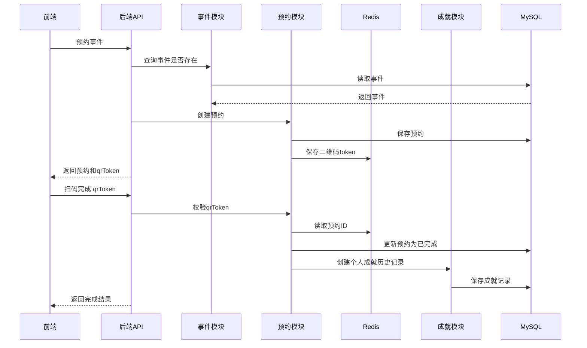
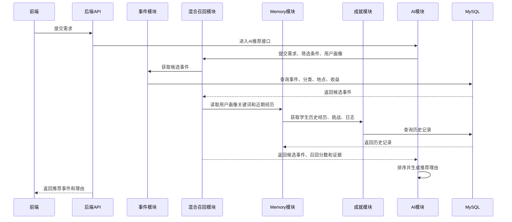
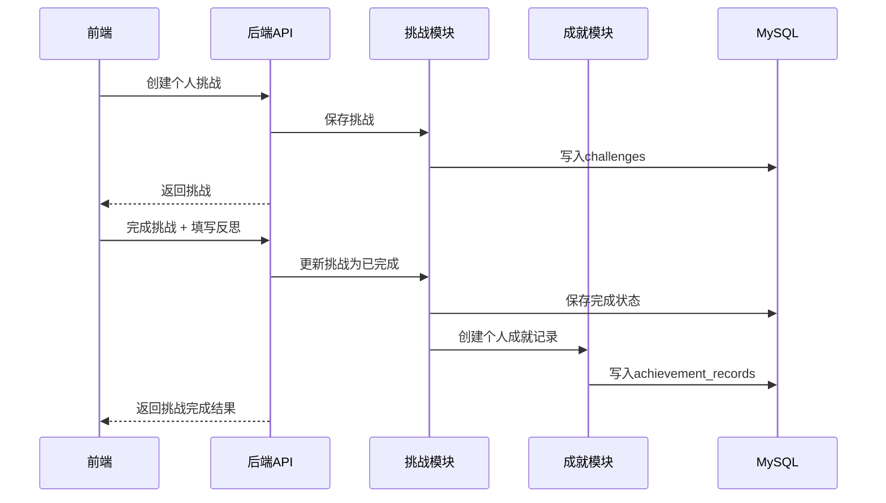

# do not miss 后端部署指南

这份指南假设你的电脑里什么环境都没有，只有前端代码 `do-not-miss-frontend` 和后端代码 `do-not-miss-backend`。

后端技术栈：

- Java 21
- Spring Boot 3.3.12
- Maven
- MySQL 8.4
- Redis 7.4
- RabbitMQ 3.13
- Flyway 数据库初始化

## 1. 模块关系

后端目前按业务拆成这些模块：

- `event`：事件发布、普通搜索、候选事件查询
- `auth`：注册、登录、退出、当前用户识别
- `organization`：组织信息维护
- `follow`：学生关注组织
- `reservation`：预约、二维码 token、扫码完成
- `challenge`：学生自定义挑战、完成挑战、沉淀到个人成就
- `achievement`：历史记录、反思、统计图数据、成长曲线数据
- `memory`：从历史活动、挑战、反思、教练日志中提取用户画像
- `retrieval`：事件混合召回，负责关键词、语义意图、用户画像和结构化字段综合打分
- `mcp`：工具上下文，提供当前时间和定位信息给推荐 Agent
- `schedule`：月视图日程、预约自动入日程、手动安排挑战/学习块
- `coach`：教练聊天、成长日志生成、日志持久化
- `ai`：AI事件推荐、计划推荐、智能简历、自我分析
- `common`：模拟登录用户、统一异常、健康检查

关键流程：



AI 推荐流程：



挑战完成流程：



## 2. 安装 Java 21

推荐安装 Temurin JDK 21：

1. 打开 https://adoptium.net/temurin/releases/
2. 选择：
   - Operating System: Windows
   - Architecture: x64
   - Package Type: JDK
   - Version: 21
3. 下载 `.msi` 安装包并安装。
4. 安装时勾选 `Set JAVA_HOME variable` 和 `Add to PATH`。

安装完成后，重新打开 PowerShell，执行：

```powershell
java -version
```

看到 `21` 相关版本号就可以。

## 3. 安装 Maven

1. 打开 https://maven.apache.org/download.cgi
2. 下载 `Binary zip archive`。
3. 解压到例如：

```text
C:\Tools\apache-maven
```

4. 配置环境变量：

```text
MAVEN_HOME=C:\Tools\apache-maven
Path 增加：%MAVEN_HOME%\bin
```

5. 重新打开 PowerShell，执行：

```powershell
mvn -v
```

能看到 Maven 版本和 Java 21 即可。

## 4. 安装 Docker Desktop

推荐用 Docker 启动 MySQL 和 Redis，这样不用手动安装数据库。

1. 打开 https://www.docker.com/products/docker-desktop/
2. 下载并安装 Docker Desktop。
3. 启动 Docker Desktop。
4. 等左下角显示 Docker Engine 正常运行。

验证：

```powershell
docker version
docker compose version
```

## 5. 启动 MySQL 和 Redis

进入后端目录：

```powershell
cd D:\warma\Documents\do-not-miss-backend
```

启动服务：

```powershell
docker compose up -d
```

查看容器状态：

```powershell
docker compose ps
```

RabbitMQ 管理后台地址：

```text
http://localhost:15672
```

默认账号：

```text
username: donotmiss
password: donotmiss123
```

OpenSearch / Elasticsearch BM25 检索是可选增强项。`docker compose up -d` 会同时准备 OpenSearch 容器；如果暂时不用搜索引擎，后端仍会默认走本地 Java 规则检索。

如果要启用搜索引擎检索，在 `.env` 或系统环境变量里增加：

```powershell
SEARCH_ENABLED=true
SEARCH_VECTOR_ENABLED=false
SEARCH_RERANK_ENABLED=false
SEARCH_RERANK_TOP_N=12
AI_EMBEDDING_MODEL=text-embedding-v4
AI_EMBEDDING_DIMENSIONS=1024
SEARCH_BASE_URL=http://localhost:9200
SEARCH_INDEX_NAME=do_not_miss_events
```

启动后端后执行一次重建索引：

```powershell
curl -X POST "http://localhost:8080/api/ai/retrieval/reindex" `
  -H "Authorization: Bearer $TOKEN"
```

启用后，事件检索会优先用 OpenSearch 的 BM25 候选召回；如果 OpenSearch 不可用，系统会自动退回本地检索逻辑。

正常情况下会看到：

- `do-not-miss-mysql`
- `do-not-miss-redis`
- `do-not-miss-rabbitmq`
- `do-not-miss-opensearch`

## 6. 启动 Spring Boot 后端

仍然在后端目录执行：

```powershell
mvn spring-boot:run
```

第一次运行会下载依赖，可能需要几分钟。

如果是从旧版本升级，Spring Boot 启动时 Flyway 会自动执行后续迁移：

- `V4__add_schedule_items.sql`：创建 `schedule_items` 表，并把已有未完成预约回填到 schedule 中。
- `V5__add_coach_logs.sql`：创建 `coach_messages` 和 `coach_logs` 表，用于教练聊天和成长日志。
- `V11__add_domain_event_outbox.sql`：创建 `domain_event_outbox` 表，用于 RabbitMQ 消息可靠投递和失败重试。
- `V12__add_event_expired_flag.sql`：为 `events` 增加 `expired` 标记，启动时自动把已结束活动标记为过期，前端列表和 AI 召回默认不展示过期活动。

这些迁移都会自动执行，不需要手动改数据库。

启动成功后，访问：

```text
http://localhost:8080/api/health
```

如果返回：

```json
{
  "status": "ok",
  "service": "do-not-miss-backend"
}
```

说明后端已启动。

## 7. 常用接口测试

### 7.1 查看事件

```powershell
curl "http://localhost:8080/api/events"
```

### 7.2 普通搜索事件

```powershell
curl "http://localhost:8080/api/events?keyword=日语&benefitType=技能经验"
```

### 7.3 注册 / 登录

大部分个人接口都需要登录 token。先用内置 demo 账号登录：

```powershell
$login = curl -X POST "http://localhost:8080/api/auth/login" `
  -H "Content-Type: application/json" `
  -d "{""account"":""demo_student"",""password"":""demo123456""}" | ConvertFrom-Json

$TOKEN = $login.token
```

社会端 demo 账号：

```powershell
$login = curl -X POST "http://localhost:8080/api/auth/login" `
  -H "Content-Type: application/json" `
  -d "{""account"":""demo_social"",""password"":""demo123456""}" | ConvertFrom-Json

$TOKEN = $login.token
```

注册新用户：

```powershell
curl -X POST "http://localhost:8080/api/auth/register" `
  -H "Content-Type: application/json" `
  -d "{""username"":""my_student"",""email"":""me@example.com"",""password"":""12345678"",""role"":""STUDENT""}"
```

后续请求统一带：

```powershell
-H "Authorization: Bearer $TOKEN"
```

### 7.4 AI推荐事件

```powershell
curl -X POST "http://localhost:8080/api/ai/event-recommendations" `
  -H "Content-Type: application/json" `
  -H "Authorization: Bearer $TOKEN" `
  -d "{""need"":""想练日语，周末参加，最好有报酬""}"
```

### 7.4.1 AI推荐计划

```powershell
curl -X POST "http://localhost:8080/api/ai/action-plans" `
  -H "Content-Type: application/json" `
  -H "Authorization: Bearer $TOKEN" `
  -d "{""goal"":""想提升日语能力，同时参加线下实践"",""horizonDays"":14,""intensity"":""balanced"",""location"":""大阪""}"
```

返回结果里会有多份 `plans`。每份计划包含 `title`、`style`、`summary`、`steps` 和 `warnings`；步骤里如果来自数据库事件，会带 `eventId`，前端可以据此展示预约按钮或跳转事件卡片。

### 7.5 发布事件

```powershell
curl -X POST "http://localhost:8080/api/events" `
  -H "Content-Type: application/json" `
  -H "Authorization: Bearer $TOKEN" `
  -d "{""title"":""商店街采访协助"",""organizationName"":""Tokyo Local Lab"",""category"":""研究"",""startTime"":""2026-07-01T14:00:00"",""location"":""东京 中野"",""content"":""协助采访商店街店主并整理访谈记录。"",""benefitType"":""两者都有"",""skill"":""访谈、日语沟通、资料整理"",""moneyAmount"":3000}"
```

### 7.6 预约事件

```powershell
curl -X POST "http://localhost:8080/api/reservations" `
  -H "Content-Type: application/json" `
  -H "Authorization: Bearer $TOKEN" `
  -d "{""eventId"":3}"
```

返回里会有 `qrToken`。复制这个 token。

### 7.7 扫码完成

把上一步拿到的 token 放进去：

```powershell
curl -X POST "http://localhost:8080/api/reservations/scan-complete" `
  -H "Content-Type: application/json" `
  -H "Authorization: Bearer $TOKEN" `
  -d "{""qrToken"":""这里替换成返回的qrToken""}"
```

完成后，预约会变成已完成，并自动进入个人成就历史。

### 7.8 查看个人成就历史

```powershell
curl "http://localhost:8080/api/achievements/history" `
  -H "Authorization: Bearer $TOKEN"
```

### 7.9 保存历史反思

```powershell
curl -X PUT "http://localhost:8080/api/achievements/history/1/reflection" `
  -H "Content-Type: application/json" `
  -H "Authorization: Bearer $TOKEN" `
  -d "{""did"":""负责现场引导和问卷回收。"",""learned"":""学会了活动现场分工和即时沟通。""}"
```

### 7.10 获取统计图数据

```powershell
curl "http://localhost:8080/api/achievements/summary" `
  -H "Authorization: Bearer $TOKEN"
```

### 7.11 生成智能简历分析

```powershell
curl -X POST "http://localhost:8080/api/ai/self-analysis" `
  -H "Authorization: Bearer $TOKEN"
```

### 7.12 创建挑战

```powershell
curl -X POST "http://localhost:8080/api/challenges" `
  -H "Content-Type: application/json" `
  -H "Authorization: Bearer $TOKEN" `
  -d "{""title"":""减肥到70kg"",""category"":""身体挑战"",""goal"":""体重降到70kg并保持两周"",""description"":""每周运动三次，记录饮食和体重变化。""}"
```

### 7.13 查看挑战

```powershell
curl "http://localhost:8080/api/challenges?status=ACTIVE" `
  -H "Authorization: Bearer $TOKEN"
```

分页查看挑战：

```powershell
curl "http://localhost:8080/api/challenges/page?status=ACTIVE&page=0&size=5" `
  -H "Authorization: Bearer $TOKEN"
```

### 7.14 完成挑战

```powershell
curl -X POST "http://localhost:8080/api/challenges/1/complete" `
  -H "Content-Type: application/json" `
  -H "Authorization: Bearer $TOKEN" `
  -d "{""did"":""完成30天运动和饮食记录。"",""learned"":""更理解长期目标需要稳定节奏和可量化记录。""}"
```

完成挑战后，它会自动进入 `/api/achievements/history`，并影响 `/api/achievements/summary` 和 `/api/ai/self-analysis`。

分页查看历史记录：

```powershell
curl "http://localhost:8080/api/achievements/history/page?page=0&size=5" `
  -H "Authorization: Bearer $TOKEN"
```

### 7.15 查看用户画像 Memory

```powershell
curl "http://localhost:8080/api/ai/profile-memory" `
  -H "Authorization: Bearer $TOKEN"
```

这个接口会从学生已经完成的活动、挑战、反思里抽取结构化画像，包括偏好类别、常见地点、收益倾向、能力关键词和近期经历信号。AI 推荐和自我分析都会使用这份画像作为长期记忆。

### 7.16 查看 Schedule 月视图

```powershell
curl "http://localhost:8080/api/schedule?month=2026-06" `
  -H "Authorization: Bearer $TOKEN"
```

预约活动成功后，后端会自动把活动加入 schedule。取消预约后，对应日程会被取消。

### 7.17 手动添加挑战或学习时间块

```powershell
curl -X POST "http://localhost:8080/api/schedule" `
  -H "Content-Type: application/json" `
  -H "Authorization: Bearer $TOKEN" `
  -d "{""title"":""学习 Go 语言"",""itemType"":""CUSTOM"",""startTime"":""2026-06-10T09:00:00"",""endTime"":""2026-06-10T11:00:00"",""location"":""线上"",""notes"":""完成基础语法和一个小 demo""}"
```

如果要关联挑战，把 `itemType` 改成 `CHALLENGE`，并传入 `sourceId` 为挑战 id。

### 7.18 教练聊天

```powershell
curl -X POST "http://localhost:8080/api/coach/chat" `
  -H "Content-Type: application/json" `
  -H "Authorization: Bearer $TOKEN" `
  -d "{""message"":""我今天学了 Spring Boot 接口设计，请问我两个复盘问题。""}"
```

如果聊天内容里包含“生成日志”“写日志”“保存日志”等意图，后端会在回复的同时生成今天的成长日志。

### 7.19 生成 / 查看成长日志

```powershell
curl -X POST "http://localhost:8080/api/coach/logs/generate" `
  -H "Content-Type: application/json" `
  -H "Authorization: Bearer $TOKEN" `
  -d "{}"
```

```powershell
curl "http://localhost:8080/api/coach/logs" `
  -H "Authorization: Bearer $TOKEN"
```

成长日志会进入用户画像 Memory，后续会影响事件推荐、计划推荐和自我分析。

### 7.20 测试 MCP 工具上下文

```powershell
curl -X POST "http://localhost:8080/api/mcp/context" `
  -H "Content-Type: application/json" `
  -d "{""timezone"":""Asia/Tokyo"",""latitude"":34.6937,""longitude"":135.5023,""locationText"":""日本 大阪""}"
```

返回结果会包含 `currentTime`、`location` 和 `toolTrace`。AI 事件推荐和计划推荐会自动使用这份工具上下文；前端会尽量从浏览器读取时区和定位，定位被拒绝时使用后端默认地点。

## 8. 启动 Vue 前端

前端已经升级为：

- Vue 3
- TypeScript
- Vite
- Vue Router
- Pinia

主要业务数据仍然通过后端 `/api` 接口访问。当前已经迁移完成的基础能力包括：

- 登录 / 注册
- 七天登录会话恢复
- 学生端 / 社会端角色路由保护
- 统一 API 客户端
- `401` 登录失效处理

原来的静态页面完整保存在：

```text
do-not-miss-frontend\legacy-index.html
```

它只用于后续逐模块迁移时对照，不再是默认入口。

### 8.1 安装 Node.js

下载并安装 Node.js LTS：

```text
https://nodejs.org/
```

安装后重新打开 PowerShell，检查：

```powershell
node --version
npm --version
```

### 8.2 第一次安装前端依赖

```powershell
cd D:\warma\Documents\do-not-miss-frontend
npm install
```

只有第一次运行、删除过 `node_modules`，或者 `package.json` 发生变化时才需要重新执行。

### 8.3 开发模式启动

先确保 Spring Boot 后端运行在 `8080`，然后新开一个 PowerShell：

```powershell
cd D:\warma\Documents\do-not-miss-frontend
npm run dev
```

浏览器访问：

```text
http://127.0.0.1:5173
```

Vite 会把 `/api` 请求代理到：

```text
http://localhost:8080
```

因此开发环境不需要在前端代码里写死后端地址。

### 8.4 生产构建

```powershell
cd D:\warma\Documents\do-not-miss-frontend
npm run build
```

构建结果位于：

```text
do-not-miss-frontend\dist
```

可以使用：

```powershell
npm run preview
```

预览生产构建。

如果前后端部署在不同域名，可以创建前端 `.env`：

```text
VITE_API_BASE_URL=https://api.example.com
```

修改环境变量后需要重新执行 `npm run build`。

当前通过 API 连接的业务包括：

- 登录 / 注册
- 事件列表 / 发布 / 删除
- 预约 / 取消预约 / 扫码完成
- 挑战创建 / 取消 / 完成
- 成就历史 / 反思保存
- 关注组织
- AI 事件推荐 / AI 计划推荐 / 自我分析
- 用户画像 Memory
- Schedule 日程月视图 / 手动安排 / 预约自动入日程
- 教练聊天 / 成长日志生成 / 成长日志列表

后端地址：

```text
http://localhost:8080
```

不要再直接双击 `index.html`。Vue Router 和 Vite 模块需要通过开发服务器或生产静态服务器访问。

## 9. 手动安装 MySQL/Redis 的替代方式

如果不用 Docker，需要自己安装：

- MySQL 8.x
- Redis 7.x

然后创建数据库和用户：

```sql
CREATE DATABASE do_not_miss CHARACTER SET utf8mb4 COLLATE utf8mb4_unicode_ci;
CREATE USER 'donotmiss'@'localhost' IDENTIFIED BY 'donotmiss123';
GRANT ALL PRIVILEGES ON do_not_miss.* TO 'donotmiss'@'localhost';
FLUSH PRIVILEGES;
```

Redis 默认使用：

```text
localhost:6379
```

然后运行后端：

```powershell
mvn spring-boot:run
```

## 10. 常见问题

### 端口 3306 被占用

说明本机已有 MySQL。可以修改 `docker-compose.yml`：

```yaml
ports:
  - "3307:3306"
```

然后启动后端时指定：

```powershell
$env:DB_URL="jdbc:mysql://localhost:3307/do_not_miss?useUnicode=true&characterEncoding=utf8&serverTimezone=Asia/Tokyo"
mvn spring-boot:run
```

### 端口 8080 被占用

```powershell
$env:SERVER_PORT="8081"
mvn spring-boot:run
```

访问：

```text
http://localhost:8081/api/health
```

### 想重置数据库

这会删除本地数据：

```powershell
docker compose down -v
docker compose up -d
mvn spring-boot:run
```

### AI 为什么没有调用真实大模型？

如果 `app.ai.provider=mock`，AI 模块会使用本地规则模拟，目的是没有 API Key 也能跑通完整业务。

如果已经配置 `AI_PROVIDER=qwen` 和 `DASHSCOPE_API_KEY`，但返回仍然是 `mock` 或 `qwen:mock-fallback`，一般是 Key 没被当前进程读取、模型接口请求失败，或者模型返回的 JSON 没通过后端校验。确认 `.env` 位于后端根目录，并重启 `mvn spring-boot:run`。

## 11. 混合召回 / RAG 说明

当前项目没有直接上向量数据库，而是先实现了一个轻量的 RAG 检索层：`HybridEventRetrievalService`。

一次推荐请求会经过这些步骤：

1. SQL 硬过滤：根据分类、收益类型、地点等结构化条件缩小候选事件。
2. BM25 风格关键词召回：把学生需求、事件标题、内容、技能、组织、地点拆成 token，计算关键词相关性。
3. 语义意图打分：根据“日语、运动、公益、研究、线上、报酬”等意图词，给匹配事件加权。
4. 用户画像打分：读取 Memory 里的偏好类别、常见地点、收益倾向、能力关键词、近期经历，让推荐贴近学生历史。
5. MCP 工具上下文：读取当前时间、时区和定位信息，优先未来可参加、时间更近、地点更匹配的事件。
6. 证据返回：召回层不仅返回事件，还返回分数和 evidence，AI 只能围绕这些候选事件生成推荐理由或计划。

这样做的好处是：事件必须来自数据库，推荐理由有证据链，排序逻辑可解释；以后如果要升级成正式 RAG，可以把第 2 步替换成向量检索或 BM25 + 向量混合召回，其他 API 基本不用改。

## 12. 参考文档

- Spring Boot System Requirements: https://docs.spring.io/spring-boot/system-requirements.html
- Docker Compose Docs: https://docs.docker.com/compose/
- MySQL Docker Image: https://hub.docker.com/_/mysql
- Redis Docker Image: https://hub.docker.com/_/redis
- RabbitMQ Docker Image: https://hub.docker.com/_/rabbitmq

## 13. 接入千问真实 AI

后端现在支持两种 AI 模式：

- `mock`：默认模式，不需要 API Key，使用本地规则模拟推荐和分析。
- `qwen`：调用阿里云百炼/通义千问的 OpenAI 兼容接口。

### 13.1 推荐方式：使用本地 `.env` 文件

后端启动时会自动读取 `D:\warma\Documents\do-not-miss-backend\.env`。

在后端目录新建 `.env` 文件，内容如下：

```properties
AI_PROVIDER=qwen
AI_MODEL=qwen-plus
AI_BASE_URL=https://dashscope.aliyuncs.com/compatible-mode/v1
DASHSCOPE_API_KEY=你的百炼API Key
MCP_DEFAULT_TIMEZONE=Asia/Tokyo
MCP_DEFAULT_LOCATION=日本 大阪
```

然后正常启动后端：

```powershell
cd D:\warma\Documents\do-not-miss-backend
docker compose up -d mysql redis
mvn spring-boot:run
```

`.env` 已经被 `.gitignore` 忽略，不应该提交到代码仓库。

### 13.2 PowerShell 临时配置

在启动后端的同一个 PowerShell 窗口里执行：

```powershell
cd D:\warma\Documents\do-not-miss-backend

$env:AI_PROVIDER="qwen"
$env:DASHSCOPE_API_KEY="你的百炼API Key"
$env:AI_MODEL="qwen-plus"
$env:AI_BASE_URL="https://dashscope.aliyuncs.com/compatible-mode/v1"
$env:MCP_DEFAULT_TIMEZONE="Asia/Tokyo"
$env:MCP_DEFAULT_LOCATION="日本 大阪"

mvn spring-boot:run
```

如果只想退回本地模拟 AI：

```powershell
$env:AI_PROVIDER="mock"
mvn spring-boot:run
```

### 13.3 Windows 永久配置

如果不想每次都手动设置，可以在 PowerShell 执行：

```powershell
setx AI_PROVIDER "qwen"
setx DASHSCOPE_API_KEY "你的百炼API Key"
setx AI_MODEL "qwen-plus"
setx AI_BASE_URL "https://dashscope.aliyuncs.com/compatible-mode/v1"
setx MCP_DEFAULT_TIMEZONE "Asia/Tokyo"
setx MCP_DEFAULT_LOCATION "日本 大阪"
```

执行 `setx` 后，需要重新打开 PowerShell 才会生效。

### 13.4 测试 AI 推荐

先登录拿 token：

```powershell
$login = curl -X POST "http://localhost:8080/api/auth/login" `
  -H "Content-Type: application/json" `
  -d "{""account"":""demo_student"",""password"":""demo123456""}" | ConvertFrom-Json

$TOKEN = $login.token
```

再请求 AI 推荐：

```powershell
curl -X POST "http://localhost:8080/api/ai/event-recommendations" `
  -H "Content-Type: application/json" `
  -H "Authorization: Bearer $TOKEN" `
  -d "{""need"":""我想提升日语沟通能力，最好周末能参加，有一点报酬""}"
```

如果返回里的 `mode` 类似 `qwen:qwen-plus`，说明已经调用真实模型。
如果返回 `mock` 或 `qwen:mock-fallback`，说明没有配置 Key、模型接口请求失败，或者模型返回的 JSON 没通过后端校验。

### 13.5 测试 AI 计划推荐

```powershell
curl -X POST "http://localhost:8080/api/ai/action-plans" `
  -H "Content-Type: application/json" `
  -H "Authorization: Bearer $TOKEN" `
  -d "{""goal"":""想提升日语能力，同时参加线下实践"",""horizonDays"":14,""intensity"":""balanced"",""location"":""大阪""}"
```

计划推荐会先用混合召回找候选事件，再把用户画像、候选事件证据和当前 schedule 一起传给模型，让模型生成多份可选择的行动计划。

### 13.6 测试教练和成长日志

```powershell
curl -X POST "http://localhost:8080/api/coach/chat" `
  -H "Content-Type: application/json" `
  -H "Authorization: Bearer $TOKEN" `
  -d "{""message"":""我今天学了 Spring Boot 接口设计，也想坚持日语练习，请问我两个复盘问题。""}"
```

```powershell
curl -X POST "http://localhost:8080/api/coach/logs/generate" `
  -H "Content-Type: application/json" `
  -H "Authorization: Bearer $TOKEN" `
  -d "{}"
```

生成后的日志会写入 `coach_logs`，并参与 `/api/ai/profile-memory` 的用户画像构建。

### 13.7 测试智能简历分析

```powershell
curl -X POST "http://localhost:8080/api/ai/self-analysis" `
  -H "Authorization: Bearer $TOKEN"
```

注意：成长曲线、类别数量等图表数据仍然由后端计算，AI 只负责生成文字总结、简历要点、优势标签和成长建议。
