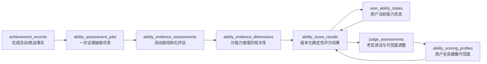

# 能力评分系统数据模型 v2

## 目标

这一阶段只建立数据底座，不启用新的评分算法，也不替换现有成长标签页面。

数据模型需要支持：

- LLM 只负责抽取结构化证据。
- Java 引擎负责可复现的确定性计算。
- Judge 测试是唯一可以自动调整 `profile_confidence` 的流程。
- 同一份证据重复消费时不会重复加分。
- 评分规则升级后保留历史结果，不覆盖旧审计记录。

## 表关系



## 七张新表

### ability_scoring_profiles

保存用户全局评分画像：

- `profile_confidence`
- `confidence_version`

初始可信度为 `0.5000`。`confidence_version` 使用 JPA 乐观锁，防止两个 Judge 流程同时覆盖同一个用户的可信度。

### user_ability_states

每个用户、每个能力维度一行，例如：

```text
warma + java-backend
warma + redis
warma + japanese-communication
```

核心字段：

- `experience_score`：累计成长证据，可持续增长。
- `ability_score`：`0..100` 的当前能力估计。
- `ability_uncertainty`：系统对能力估计的不确定度。
- `rank_name`：面向用户展示的等级。
- `state_version`：乐观锁版本，避免并发评分丢失更新。

### ability_assessment_jobs

记录一次 LLM 证据抽取任务，包括：

- 哪条成就记录触发了任务。
- 输入快照。
- 证据哈希。
- Prompt、Rubric 和模型版本。
- 执行状态、重试次数和错误。

唯一约束：

```text
achievement_record_id
+ evidence_hash
+ prompt_version
+ rubric_version
```

同一份证据和同一版规则重复投递时，不会创建第二个任务。

### ability_evidence_assessments

保存 LLM 对整项活动的结构化理解：

- 活动难度及置信度。
- 完成质量及置信度。
- 个人贡献及置信度。
- 总体抽取置信度。
- 证据发现、风险标记、新颖度特征。
- 原始模型 JSON。

这里不保存最终得分。

### ability_evidence_dimensions

一项活动可能影响多个能力，因此拆成子表：

```text
Spring Boot 项目
  -> Java 后端开发 relevance=0.80
  -> Spring Boot relevance=0.95
  -> SQL relevance=0.55
```

每个维度保存相关性、相关性置信度、学习产出和对应证据引用。

### ability_score_results

保存 Java 评分引擎的完整计算结果：

- 计算前后的经验分、能力分和不确定度。
- 暂定经验增量与已验证经验增量。
- 成长价值、验证强度。
- 难度倍率、可信度倍率。
- 完整因素快照。
- Judge 触发原因。
- 评分规则版本和历史快照版本。

旧结果不会被覆盖。重新计算时创建新结果，并通过 `supersedes_result_id` 指向旧版本。

### judge_assessments

保存考官流程：

- 为什么触发测试。
- 题目、答案、Rubric 评分。
- 测试前可信度。
- 建议可信度变化。
- 最终可信度。
- 自动 Judge 或人工审核人。

数据库将单次可信度变化限制在 `-0.0800..0.0800`。

## 一条活动的未来数据流

```text
用户完成活动
-> achievement_records 保存事实
-> 创建 ability_assessment_jobs
-> Evidence Assessment LLM 输出结构化因素
-> 保存 ability_evidence_assessments / ability_evidence_dimensions
-> Java 评分引擎读取当前 ability state 和 profile confidence
-> 保存 ability_score_results
-> 乐观锁更新 user_ability_states
-> 达到阈值或发现异常时创建 judge_assessments
-> Judge 完成后更新 ability_scoring_profiles
```

## 与旧系统的关系

现有：

- `growth_tags`
- `growth_tag_evidences`
- `GrowthTagService`

仍然保持不变，继续服务当前能力地图。

后续接入时：

- 智能标签负责“这是什么能力”。
- Evidence Assessment Agent 负责“证据说明了什么”。
- Java Scoring Engine 负责“确定性地加多少分”。
- Judge Agent 负责“阈值验证和可信度调整”。

