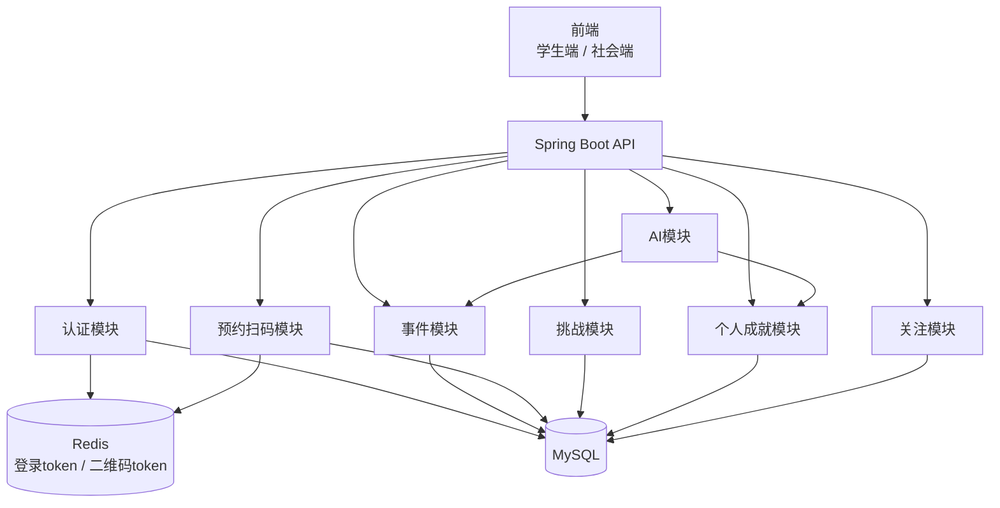

# do not miss 项目八股

## 1. 项目一句话介绍

`do not miss` 是一个面向大学生的成长机会与个人成就平台。它把外部组织发布的社会实践事件、学生自定义挑战、预约签到、历史记录、成长统计和 AI 智能简历整合在一起，目标是解决学生信息闭塞、实践机会分散、成长经历难以沉淀的问题。

面试中可以这样说：

> 我做的是一个面向大学生的社会实践和成长管理平台。社会端可以发布实践事件，学生端可以搜索事件、AI 推荐事件、预约并扫码完成。完成后的事件会进入个人成就模块，学生可以补充反思，系统再基于历史经历生成统计图、成长曲线和智能简历。同时我还加入了个人挑战功能，解决平台早期事件供给不足的问题，让学生即使没有外部活动，也能通过自定义目标积累成长档案。

## 2. 为什么加“挑战”模块

纯事件平台有冷启动问题：如果没有足够多的公司、公益组织、学校部门来发布事件，学生端就会显得很空。

挑战模块解决的是：

- 没有外部事件时，学生仍然可以自定义目标。
- 挑战完成后也能进入个人成就。
- 挑战数据可以反过来丰富学生画像。
- AI 推荐可以结合“学生想做什么”和“学生已经做过什么”。

可以这样解释：

> 事件是外部机会，挑战是内部目标。事件解决“别人提供机会”，挑战解决“学生主动成长”。两者最终都沉淀到成就系统里，这样平台不完全依赖外部组织供给。

## 3. 当前系统模块

后端主要模块：

- `auth`：注册、登录、退出、token 解析当前用户
- `event`：社会端发布事件、学生端搜索事件
- `organization`：组织信息维护
- `follow`：关注组织
- `reservation`：预约事件、生成二维码 token、扫码完成
- `challenge`：创建挑战、完成挑战、取消挑战
- `achievement`：历史记录、反思、类别统计、成长曲线
- `ai`：事件推荐、智能简历、自我分析
- `common`：统一异常、分页返回、健康检查、当前用户解析

前端主要模块：

- 学生端：事件、我的预约、挑战、关注、个人成就
- 社会端：上传事件、我的事件
- 登录/注册：本地原型用户隔离，后端设计为 token 模式

## 4. 技术栈

后端：

- Java 21
- Spring Boot 3.3
- Spring Web
- Spring Data JPA
- MySQL
- Redis
- Flyway
- Maven

前端：

- 原生 HTML/CSS/JavaScript
- `localStorage` 做原型数据持久化

为什么先用原生前端：

> 这个项目当前重点不是复杂前端工程化，而是验证业务闭环，所以前端先用原生 HTML/CSS/JS 做原型。等业务稳定后可以迁移到 Vue 或 React。

## 5. 整体架构



可以这样说：

> 前端只负责展示和交互，后端 API 负责业务编排。核心数据落 MySQL，比如用户、事件、预约、挑战、成就记录。Redis 主要用来保存短期 token，比如登录 token 和扫码完成的二维码 token。AI 模块不直接改业务数据，而是读取事件和成就数据，返回推荐理由或总结文案。

## 6. 用户登录设计

当前后端设计：

- 用户注册后保存到 `users` 表。
- 密码注册时用 BCrypt 哈希。
- 登录成功后生成随机 token。
- token 存 Redis，设置过期时间。
- 前端后续请求带：

```http
Authorization: Bearer <token>
```

为什么不用 `X-User-Id`：

> `X-User-Id` 只能用于原型模拟，不安全，任何人都能伪造用户身份。接入登录后，应该由后端生成 token，前端只保存 token，请求时通过 token 找当前用户。

为什么 token 放 Redis：

- 方便设置过期时间。
- 方便主动退出登录。
- 服务端可以随时让 token 失效。
- 比纯前端自存用户 ID 更安全。

和 JWT 的区别：

- 当前是服务端 session token，状态存在 Redis。
- JWT 是自包含 token，服务端不一定保存状态。
- Redis token 更方便注销和服务端控制。
- JWT 更适合无状态扩展，但撤销会麻烦一些。

## 7. 事件模块设计

事件字段：

- 标题
- 组织名称
- 分类
- 时间
- 地点
- 内容
- 收益类型
- 技能经验
- 金钱报酬
- 创建人

收益类型：

- `SKILL`
- `MONEY`
- `BOTH`

搜索逻辑：

- 关键词匹配标题、组织、地点、内容、技能
- 分类筛选
- 地点筛选
- 收益类型筛选
- 按开始时间排序

为什么用 JPA Specification：

> 普通搜索条件是动态组合的，用户可能只传关键词，也可能同时传分类、地点、收益类型。Specification 可以动态拼接查询条件，避免写很多不同的 Repository 方法。

## 8. 关注模块设计

关注表核心字段：

- `user_id`
- `organization_name`
- `created_at`

唯一约束：

```sql
UNIQUE (user_id, organization_name)
```

为什么要唯一约束：

> 防止同一个学生重复关注同一个组织。即使前端重复点击，数据库也能保证数据不重复。

## 9. 预约和扫码完成

流程：

1. 学生预约事件。
2. 后端创建预约记录。
3. 后端生成 `qrToken`。
4. `qrToken -> reservationId` 存 Redis。
5. 学生扫码完成时提交 `qrToken`。
6. 后端校验 token。
7. 预约状态改为 `COMPLETED`。
8. 创建个人成就历史记录。

为什么二维码 token 存 Redis：

- 二维码是短期有效数据。
- Redis 支持 TTL。
- 校验速度快。
- 扫码完成后可以立即删除 token，防止重复使用。

为什么还在数据库保存 `qrToken`：

> Redis 过期或重启时，数据库可以作为兜底。生产环境中可以根据安全要求决定是否允许兜底。

预约状态：

- `RESERVED`
- `COMPLETED`
- `CANCELLED`

为什么需要状态而不是删除：

> 删除会丢失行为记录，状态字段可以保留用户操作轨迹。比如取消预约和完成预约是不同业务事实。

## 10. 挑战模块设计

挑战字段：

- 用户 ID
- 标题
- 分类
- 目标
- 描述
- 状态
- 创建时间
- 完成时间
- 做了什么
- 学到了什么

状态：

- `ACTIVE`
- `COMPLETED`
- `CANCELLED`

完成挑战流程：

1. 学生创建挑战。
2. 挑战状态为 `ACTIVE`。
3. 学生填写“做了什么 / 学到了什么”。
4. 点击完成。
5. 挑战状态改为 `COMPLETED`。
6. 成就模块创建一条 `CHALLENGE` 来源的历史记录。

为什么挑战也进入成就模块：

> 因为事件和挑战本质上都是成长经历。区别只是来源不同：事件来自外部组织，挑战来自学生自己。统一进入成就模块后，统计、成长曲线和 AI 简历可以复用同一套逻辑。

## 11. 个人成就设计

成就记录来源：

- `EVENT`
- `CHALLENGE`

成就记录核心字段：

- 来源类型
- 来源 ID
- 标题
- 组织名或“个人挑战”
- 分类
- 内容
- 技能
- 完成时间
- 做了什么
- 学到了什么

为什么成就记录要复制一份事件/挑战信息：

> 因为事件或挑战以后可能被修改，但学生完成时的经历应该保持历史快照。例如组织修改了活动标题，不应该影响学生过去的成就记录。

## 12. 统计图和成长曲线

统计图：

- 按类别统计完成数量。
- 事件和挑战都参与统计。

成长曲线：

- 后端根据历史记录文本计算不同能力维度分数。
- 前端负责可视化。

能力维度示例：

- 沟通表达
- 执行协作
- 调研分析
- 内容创作
- 跨文化理解

为什么不让 AI 直接画图：

> 图表数据应该由后端规则稳定计算，保证可解释、可复现。AI 更适合做文字解释和总结，而不是决定核心统计数字。

## 13. AI 推荐事件

输入：

- 学生自然语言需求
- 候选事件列表
- 学生历史成就

输出：

- 推荐事件
- 推荐分数
- 推荐理由

当前是 mock 规则：

- 关键词匹配
- 需求意图识别
- 历史经历相关性

以后接真实大模型：

> 保持 API 不变，只替换 `AiService` 内部实现。业务模块不需要知道底层是规则推荐还是大模型推荐。

## 14. AI 智能简历

输入：

- 完成过的事件
- 完成过的挑战
- 学生写的“做了什么”
- 学生写的“学到了什么”
- 统计数据
- 成长曲线数据

输出：

- 成长经历总结
- 简历 bullet points
- 优势能力
- 下一步建议

可以这样说：

> AI 不直接创造经历，而是基于学生真实完成记录和反思来总结，这样生成的智能简历更可信，也更容易解释。

## 15. MySQL 设计重点

使用 MySQL 存：

- 用户
- 事件
- 组织
- 关注
- 预约
- 挑战
- 成就记录

为什么 MySQL：

- 数据结构清晰。
- 关系明确。
- 需要事务。
- 需要唯一约束和索引。

重要索引：

- 事件分类、时间、组织索引
- 预约用户 + 状态索引
- 成就用户 + 完成时间索引
- 挑战用户 + 状态索引
- 关注用户 + 组织唯一索引

## 16. Redis 设计重点

Redis 用途：

- 登录 token
- 二维码 token

不把核心业务数据放 Redis：

> 事件、预约、挑战、成就这些是核心数据，必须落 MySQL。Redis 只存临时态和高频校验数据。

## 17. 事务设计

需要事务的地方：

- 发布事件并创建组织
- 预约事件
- 扫码完成并创建成就
- 完成挑战并创建成就
- 更新历史反思

典型事务：

```java
@Transactional
public ChallengeResponse complete(...) {
    // 1. 查询挑战
    // 2. 更新状态
    // 3. 写入成就记录
}
```

为什么需要事务：

> 比如完成挑战时，如果挑战状态改成已完成，但成就记录写入失败，就会出现数据不一致。用事务可以保证一起成功或一起失败。

## 18. 分页设计

为什么要分页：

- 挑战和历史记录会越来越多。
- 一次性返回全部数据会影响性能。
- 前端一直堆卡片体验不好。

后端分页接口：

- `GET /api/challenges/page?page=0&size=5`
- `GET /api/achievements/history/page?page=0&size=5`

分页返回结构：

- `content`
- `page`
- `size`
- `totalElements`
- `totalPages`
- `first`
- `last`

## 19. 统一异常

项目中用 `ApiException` 表示业务异常，例如：

- 参数错误
- 资源不存在
- 未登录
- 无权限

`GlobalExceptionHandler` 统一返回 JSON。

好处：

- Controller 不需要到处写 try/catch。
- 前端拿到统一错误格式。
- 方便后期扩展错误码。

## 20. 项目亮点总结

可以背这段：

> 这个项目不是单纯的信息发布平台，而是把外部事件、个人挑战、预约签到、历史反思、AI 推荐和智能简历串成一个成长闭环。技术上我用 Spring Boot 拆分业务模块，MySQL 存核心业务数据，Redis 存登录和二维码 token，Flyway 管理数据库版本，JPA Specification 支持动态搜索，事务保证扫码完成和挑战完成时的数据一致性。AI 部分我没有让模型直接决定核心数据，而是让后端先算稳定统计，再由 AI 做推荐理由和成长总结，这样可解释性更强。

## 21. 可以主动说的不足

如果面试官问“项目还有什么不足”，可以说：

- 目前 AI 是 mock 规则实现，还没接真实大模型。
- 当前权限模型比较简单，只有学生端和社会端，后续可以细分组织管理员。
- 搜索目前基于数据库 LIKE，数据量大后可以接 Elasticsearch。
- 登录 token 是 Redis session，分布式部署没问题，但还没有 refresh token 机制。
- 扫码完成目前是 token 校验，真实线下场景还要加地理位置、时间窗口、防代签。
- 前端是原生 JS 原型，后续可迁移 Vue/React 并接后端 API。

